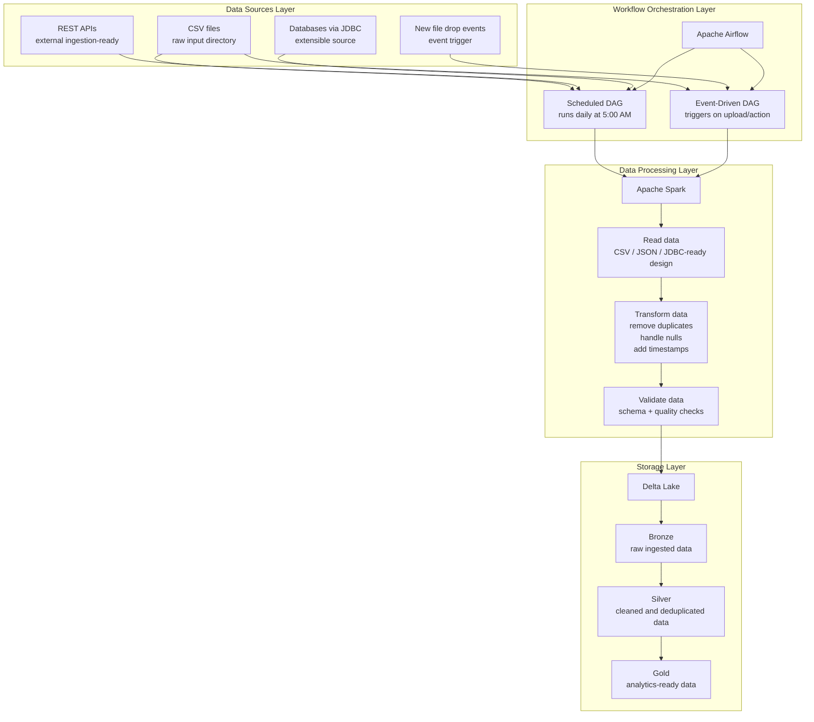

# MedallionFlow Platform

<p align="center">
  <strong>A local end-to-end data engineering platform built with Airflow, Spark, Delta Lake, Docker, and Streamlit.</strong>
</p>

<p align="center">
  
  
  
  
  
</p>

## Overview

MedallionFlow Platform is a local data platform that demonstrates a practical medallion architecture:

- **Bronze** for raw ingestion
- **Silver** for cleaned and deduplicated records
- **Gold** for analytics-ready outputs

The platform combines:

- **Apache Airflow** for workflow orchestration
- **Apache Spark** for batch data processing
- **Delta Lake** for managed storage
- **Streamlit** for UI-driven ingestion and monitoring
- **Docker Compose** for local multi-service deployment

It supports both:

- an **event-driven pipeline** for immediate processing after file upload
- a **scheduled pipeline** that queues uploaded files and processes them at the scheduled Airflow runtime

---

## Architecture

The following flow is based on the architecture you shared and aligned to the current project implementation.



### Architecture Notes

- The **current implementation primarily uses CSV-based ingestion** through the dashboard and input directory.
- The architecture is structured so it can be extended to **REST APIs, JSON, JDBC sources, and file-drop triggers**.
- The **scheduled DAG** now supports a **queue-based file handoff**, so uploaded files can wait for the next scheduled run instead of being triggered immediately.

---

## Tech Stack

<table>
  <tr>
    <td><strong>Layer</strong></td>
    <td><strong>Technology</strong></td>
    <td><strong>Purpose</strong></td>
  </tr>
  <tr>
    <td>Orchestration</td>
    <td>Apache Airflow</td>
    <td>Defines event-driven and scheduled DAG workflows</td>
  </tr>
  <tr>
    <td>Processing</td>
    <td>Apache Spark</td>
    <td>Reads source files, applies transformations, and writes Delta outputs</td>
  </tr>
  <tr>
    <td>Storage</td>
    <td>Delta Lake</td>
    <td>Stores Bronze, Silver, and Gold datasets with Delta transaction logs</td>
  </tr>
  <tr>
    <td>Frontend</td>
    <td>Streamlit</td>
    <td>Upload files, choose DAGs, monitor runs, and inspect layers</td>
  </tr>
  <tr>
    <td>Containerization</td>
    <td>Docker + Docker Compose</td>
    <td>Runs the entire platform locally as coordinated services</td>
  </tr>
  <tr>
    <td>Language</td>
    <td>Python</td>
    <td>Implements DAGs, Spark jobs, and dashboard logic</td>
  </tr>
</table>

### UI Features

The Streamlit dashboard includes:

- polished multi-page monitoring UI
- file upload and validation
- DAG selection during upload
- immediate trigger for event-driven processing
- queued submission for scheduled processing
- recent pipeline run tracking
- file name visibility per pipeline run
- Bronze / Silver / Gold layer previews
- layer metrics and record counts

---

## Core Workflows

### 1. Event-Driven Pipeline

Used when you want a file to be processed immediately.

**Flow**

1. Upload a CSV in the dashboard.
2. Choose **Event-Driven Pipeline**.
3. The dashboard sends a DAG run request to Airflow REST API.
4. Airflow triggers:
   - `bronze_job.py`
   - `silver_job.py`
   - `gold_job.py`
5. Results appear in Delta Lake and the dashboard refreshes the layer view.

### 2. Scheduled Pipeline

Used when files should wait until the scheduled execution window.

**Flow**

1. Upload a CSV in the dashboard.
2. Choose **Scheduled Pipeline**.
3. The dashboard stores the file and adds it to `input_data/upload_queue.json`.
4. The scheduled Airflow DAG runs daily at **5:00 AM**.
5. At runtime, the DAG reserves the next queued file and processes it through Bronze, Silver, and Gold.

---

## Medallion Layers

### Bronze

- stores raw ingested records
- adds ingestion timestamp
- preserves source structure with minimal changes

### Silver

- removes duplicates
- fills null values
- applies standard cleaning rules
- adds processing timestamp

### Gold

- creates analytics-ready outputs
- applies business-level enrichment
- partitions output where applicable
- supports reporting and downstream consumption

---

## Key Features

- End-to-end medallion data pipeline
- Event-driven and scheduled Airflow DAGs
- Queue-based scheduled file processing
- Streamlit monitoring dashboard
- Airflow REST API integration
- Delta Lake storage layout
- Data cleaning and deduplication
- Basic data quality and validation logic
- Local Docker Compose deployment
- Layer-wise data exploration and metrics

---

## Deliverables Covered

Based on the architecture design, this repository includes:

- **Docker configuration**
  - `docker-compose.yml`
  - service-specific Dockerfiles
- **Spark processing scripts**
  - `spark/bronze_job.py`
  - `spark/silver_job.py`
  - `spark/gold_job.py`
- **Airflow DAG definitions**
  - `dags/event_pipeline_dag.py`
  - `dags/scheduled_pipeline_dag.py`
- **Dashboard application**
  - `dashboard/app.py`
- **Documentation**
  - this README

### Bonus Features Included

- queue-backed scheduled ingestion
- Delta Lake transaction-log-based storage
- partitioned Gold output
- schema evolution support through Delta write utilities
- quality-oriented Silver cleaning rules
- dashboard run monitoring and file visibility

---

## Project Structure

```text
Prahara/
|-- airflow/
|   `-- Dockerfile
|-- dags/
|   |-- event_pipeline_dag.py
|   `-- scheduled_pipeline_dag.py
|-- dashboard/
|   |-- app.py
|   |-- app_improved.py
|   |-- Dockerfile
|   `-- requirements.txt
|-- spark/
|   |-- bronze_job.py
|   |-- silver_job.py
|   |-- gold_job.py
|   |-- delta_utils.py
|   `-- Dockerfile
|-- input_data/
|-- delta_lake/
|-- docker-compose.yml
|-- requirements.txt
`-- README.md
```

---

## Local Setup

### Prerequisites

- Docker Desktop
- Git
- Python 3.10+ for local scripting if needed

### Run the Platform

```bash
git clone https://github.com/prarthanapn/MedallionFlow-platform.git
cd MedallionFlow-platform
docker-compose up -d --build
```

### Access the Services

- **Dashboard:** `http://localhost:8501`
- **Airflow UI:** `http://localhost:8081`
- **Spark Master UI:** `http://localhost:8080`

---

## How to Use

### Upload and Trigger Immediately

1. Open the Streamlit dashboard.
2. Go to **Upload Data**.
3. Upload one or more CSV files.
4. Choose **Event-Driven Pipeline**.
5. Start the pipeline and monitor status from the dashboard.

### Upload and Queue for Schedule

1. Open the Streamlit dashboard.
2. Upload CSV files.
3. Choose **Scheduled Pipeline**.
4. Queue the files.
5. Wait for the scheduled DAG runtime to process the queued file.

### Monitor Data Layers

Use the dashboard to:

- inspect Bronze, Silver, and Gold layers
- review layer metrics
- verify record counts
- check recent pipeline runs
- identify which file triggered each run

---

## Important Files

### Orchestration

- `dags/event_pipeline_dag.py`
- `dags/scheduled_pipeline_dag.py`

### Processing

- `spark/bronze_job.py`
- `spark/silver_job.py`
- `spark/gold_job.py`
- `spark/delta_utils.py`

### UI

- `dashboard/app.py`

### Deployment

- `docker-compose.yml`
- `airflow/Dockerfile`
- `dashboard/Dockerfile`
- `spark/Dockerfile`

---

## Current Scope vs Extensibility

### Implemented Now

- CSV ingestion
- Airflow orchestration
- Spark transformation pipeline
- Delta Lake medallion storage
- Dashboard-driven file upload and monitoring
- Scheduled queue-based processing

### Designed to Extend Toward

- REST API ingestion
- JDBC database ingestion
- JSON-based inputs
- richer validation rules
- alerting and observability enhancements
- cloud-native deployment patterns

---

## Troubleshooting

### Airflow API Authentication Errors

If dashboard-triggered runs fail with authentication issues:

- confirm Airflow is running
- confirm `AIRFLOW__API__AUTH_BACKENDS=airflow.api.auth.backend.basic_auth`
- verify credentials match the configured Airflow user

### Scheduled Files Not Processing

Check:

- the scheduler container is running
- queued files exist in `input_data/upload_queue.json`
- the scheduled DAG is enabled in Airflow
- the scheduler has reloaded the latest DAG definition

### Dashboard Style or Logic Changes Not Appearing

Restart the dashboard service:

```bash
docker-compose restart dashboard
```

If DAG logic changed:

```bash
docker-compose restart airflow-webserver airflow-scheduler
```

---

## Future Improvements

- add source connectors beyond CSV
- store richer run metadata for observability
- add notifications and alerting
- add automated tests for DAGs and dashboard helpers
- improve Gold-layer business metrics and reporting
- deploy to a cloud-backed object storage environment

---

## Author

**Prarthana P N**

If you want, the next step can be:

- adding screenshots of the dashboard to this README
- adding a separate `docs/architecture.md`
- converting the README into a portfolio-style GitHub landing page
